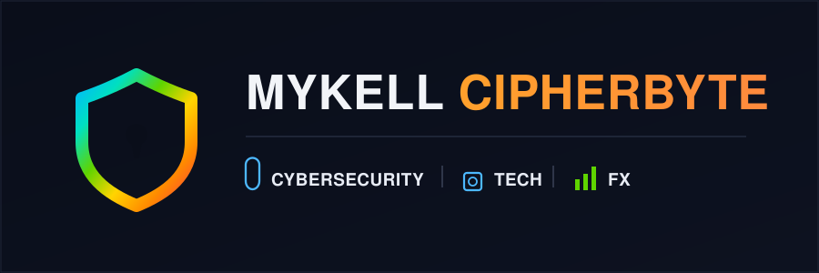

# Hi 👋, I'm Ifechukwu Michael Ozoigwe

### Cybersecurity Analyst • AI Enthusiast • Public Speaker

---

## 🛡️ About Me

- **Name:** Ifechukwu Michael Ozoigwe
- **Location:** Nigeria 🇳🇬
- **Role:**
  - Cybersecurity Analyst
  - AI Enthusiast
  - Public Speaker
- **Current Focus:**
  - Blue Team Security
  - Penetration Testing
  - Security Automation
  - Artificial Intelligence
  - Open Source

Cybersecurity student in the TechRise 3.0 program, working toward an analyst role. Preparing for the CPN exam and building Python-for-security skills. Running a home SOC lab on Kali Linux with Wazuh, Splunk, Suricata, and Snort, and connected to TryHackMe for hands-on practice. Author of a full cybersecurity learning curriculum and two beginner IT courses.

## 🧰 Tools & Tech

## 📊 GitHub Stats

